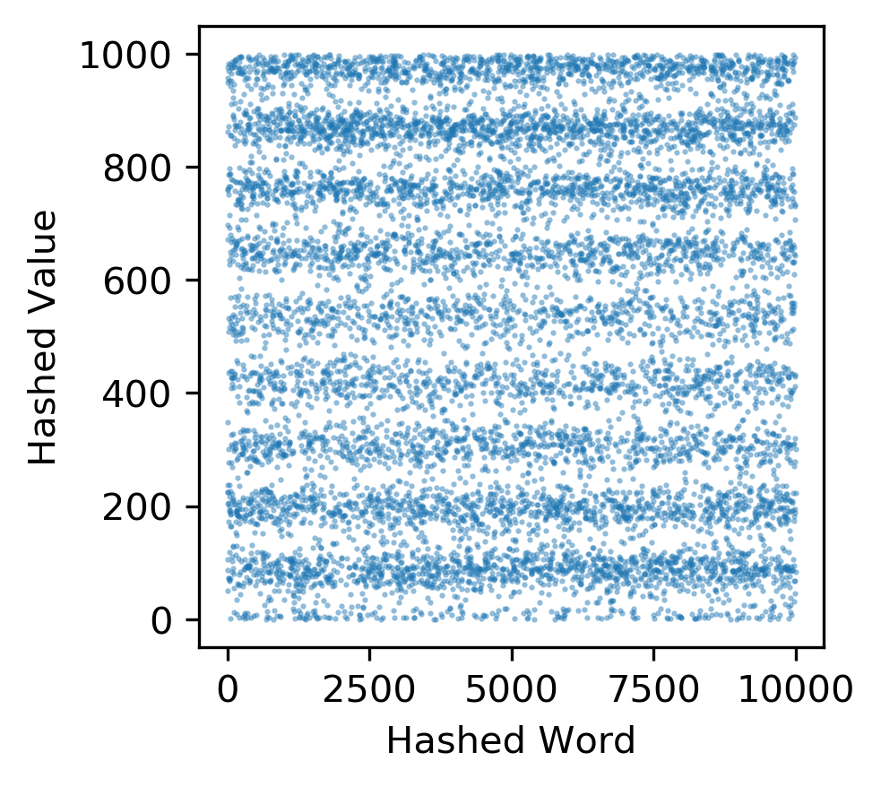
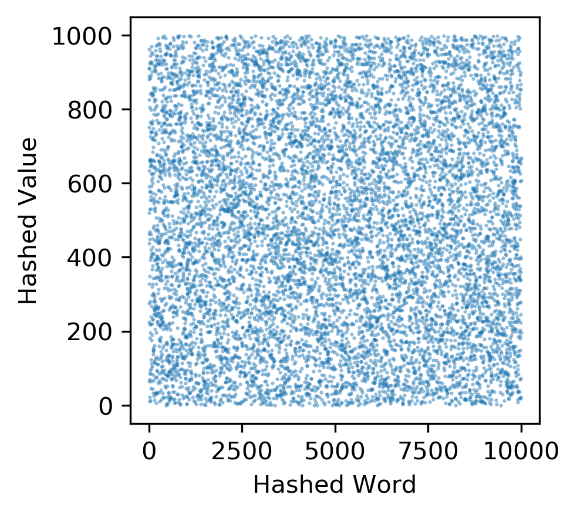
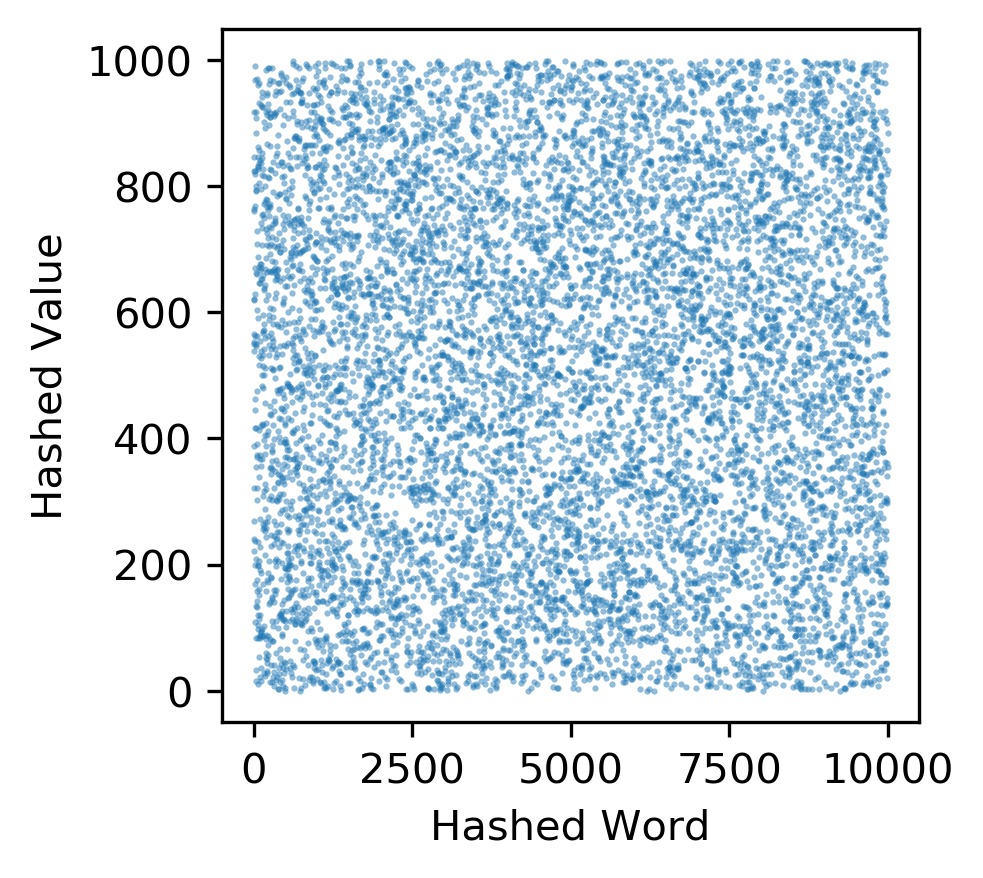
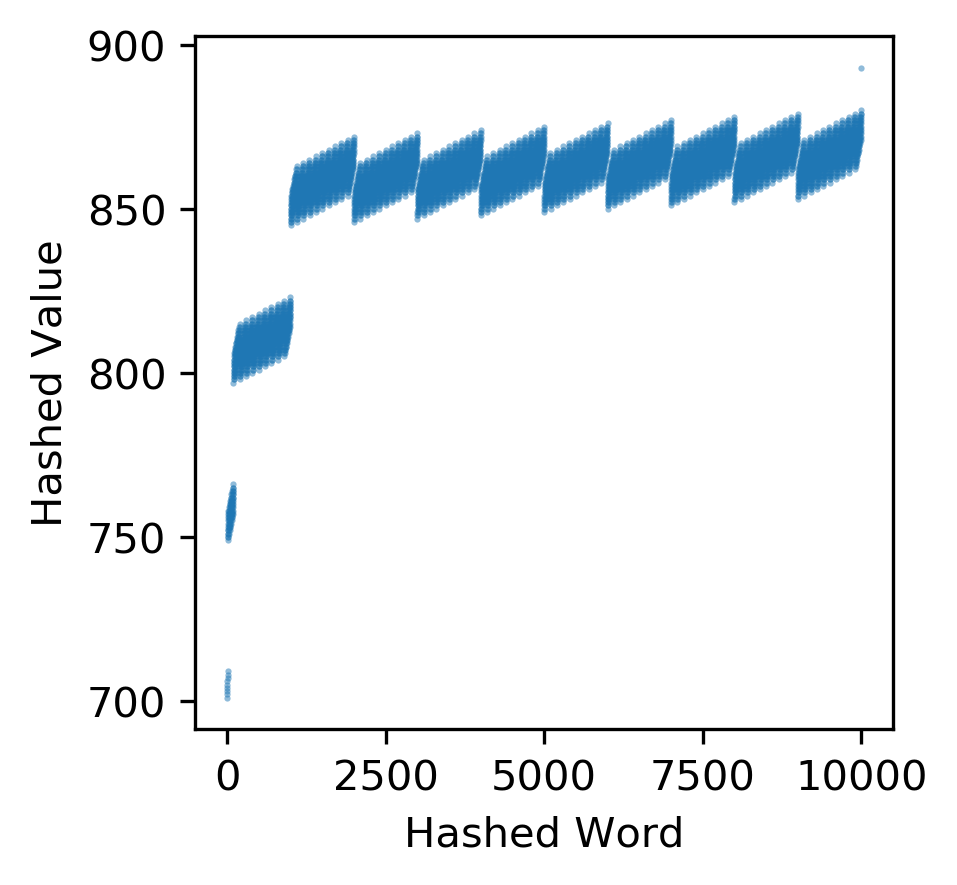
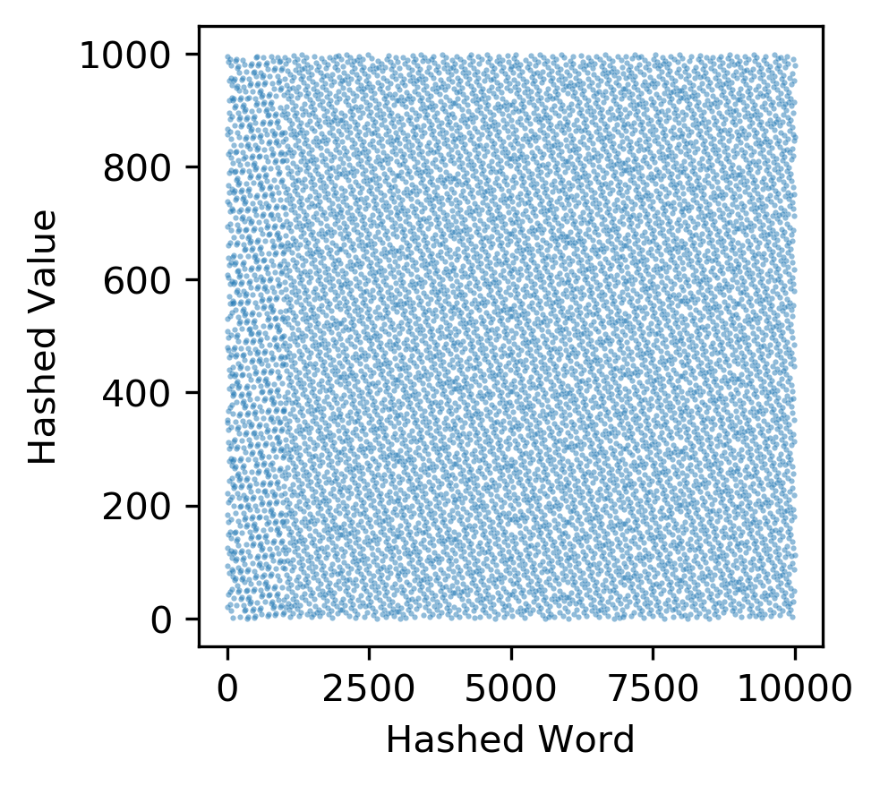
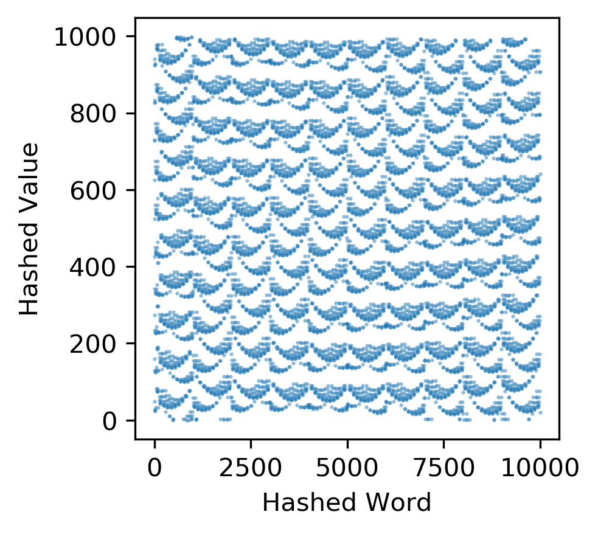

# Hash tables

## Creation
### hash_functions.py

    1. Created testing file test_hash_functions.py
        - Created tests for None input
        - Created tests for null input
        - Created tests for incorrect type input
        - Created looped test for accurate functionality


    2. Added h_ascii(key, N) method
        Description: hash function that returns a integer value within range(N) given a string
        Parameters:
            - key : string that is to be converted into a integer within the range(N)
            - N : integer that represents the size of the hash table
        
        Returns:
            - r : the hash position of string key in table of length N
        
        Error Behavior
            - Returns None given None
            - Throws TypeError given null input
            - Throws TypeError given non-list input
            - Returns None for any invalid list lengths
     
    3. Added h_rolling(key, N) method
        Description: hash function that returns a integer value within range(N) given a string
        Parameters:
            - key : string that is to be converted into a integer within the range(N)
                + currently optmized to consist only of upper and lower case letters
            - N : integer that represents the size of the hash table
        
        Returns:
            - r : the hash position of string key in table of length N
        
        Error Behavior
            - Returns None given None
            - Throws TypeError given null input
            - Throws TypeError given non-list input
            - Returns None for any invalid list lengths
     
    4. Added h_ascii_sq(key, N) method
        Description: hash function that returns a integer value within range(N) given a string
        Parameters:
            - key : string that is to be converted into a integer within the range(N)
            - N : integer that represents the size of the hash table
        
        Returns:
            - r : the hash position of string key in table of length N
        
        Error Behavior
            - Returns None given None
            - Throws TypeError given null input
            - Throws TypeError given non-list input
            - Returns None for any invalid list lengths

### hash_tables.py

    1. Created testing file test_hash_tables.py
        - Created tests for incorrect type input
        - Created tests for None class function input
        - Created looped test for accurate functionality


    2. Created class LinearProbe:
        Description: hash table class that stores (key, value), utilizes linear probe collision resolution
        Parameters:
            - self.hash_function: the hash function to be used in the table
            - self.N: the size of the hash table to be created
        
        Returns:
            - self.T: the hash table data object created
        
        Functions:
            - add(self, key, value):
                Parameters:
                    + key: a string that is to be used to place the (key, value) pair
                    + value: the integer value assocaited with the key
                Returns:
                    + True: successful addition to hash table
                    + False: unsuccessful addition to hash table

            - search(self, key):
                 Parameters:
                    + key: a string that is to be used to locate the value in the correct (key, value) pair
                Returns:
                    + value: the value associated with the key stored in the hash table
          
        Error Behavior
            - Throws Syntax Error given null input
            - Throws TypeError given incorrect input
            - Returns None given null function inputs
     

    3. Created class ChainedHash:
        Description: hash table class that stores (key, value), utilizes chained hash collision resolution
        Parameters:
            - self.hash_function: the hash function to be used in the table
            - self.N: the size of the hash table to be created
        
        Returns:
            - self.T: the hash table data object created
        
        Functions:
            - add(self, key, value):
                Parameters:
                    + key: a string that is to be used to place the (key, value) pair
                    + value: the integer value assocaited with the key
                Returns:
                    + True: successful addition to hash table
                    + False: unsuccessful addition to hash table

            - search(self, key):
                 Parameters:
                    + key: a string that is to be used to locate the value in the correct (key, value) pair
                Returns:
                    + value: the value associated with the key stored in the hash table
          
        Error Behavior
            - Throws Syntax Error given null input
            - Throws TypeError given incorrect input
            - Returns None given null function inputs

    4. Created class QuadraticProbe:
        Description: hash table class that stores (key, value), utilizes quadratic probe collision resolution
        Parameters:
            - self.hash_function: the hash function to be used in the table
            - self.N: the size of the hash table to be created
        
        Returns:
            - self.T: the hash table data object created
        
        Functions:
            - add(self, key, value):
                Parameters:
                    + key: a string that is to be used to place the (key, value) pair
                    + value: the integer value assocaited with the key
                Returns:
                    + True: successful addition to hash table
                    + False: unsuccessful addition to hash table

            - search(self, key):
                 Parameters:
                    + key: a string that is to be used to locate the value in the correct (key, value) pair
                Returns:
                    + value: the value associated with the key stored in the hash table
          
        Error Behavior
            - Throws Syntax Error given null input
            - Throws TypeError given incorrect input
            - Returns None given null function inputs

## Experimentation

### scatter.py

    1. Created plots for visulaization of hash functions given random word inputs
    
    Using random word inputs:
        
        ascii function
```
python hash_functions.py --input_file rand_words.txt --function ascii | python scatter.py --output_file_name ascii_hash_function.png
```



    rolling function
```
python hash_functions.py --input_file rand_words.txt --function rolling | python scatter.py --output_file_name rolling_hash_function.png
```



    ascii_sq function

```
python hash_functions.py --input_file rand_words.txt --function asciisq | python scatter.py --output_file_name asciisq_hash_function.png
```



Using non-random word inputs:
        
    ascii function
```
python hash_functions.py --input_file non_rand_words.txt --function ascii | python scatter.py --output_file_name ascii_hash_function_non.png
```



    rolling function
```
python hash_functions.py --input_file non_rand_words.txt --function rolling | python scatter.py --output_file_name rolling_hash_function_non.png
```



    ascii_sq function

```
python hash_functions.py --input_file non_rand_words.txt --function asciisq | python scatter.py --output_file_name asciisq_hash_function_non.png
```



Discussion:

We can see that that ascii function returns linear patterns when given random words, the other two output very random hashes. Given non-random inputs, however, both ascii methods output predictable patterns. The rolling function is far superior given non-random strings.


```
for M in $( seq  1000 1000 10000 ); do
    python hash_table.py 10000 rolling linear rand_words.txt $M >  rolling_linear_rand.$M.txt
done

grep insert rolling_linear_rand.*.txt | cut -d " " -f2,3 | python scatter.py rolling_insert_time.png "Load factor" "Insert time"
```

